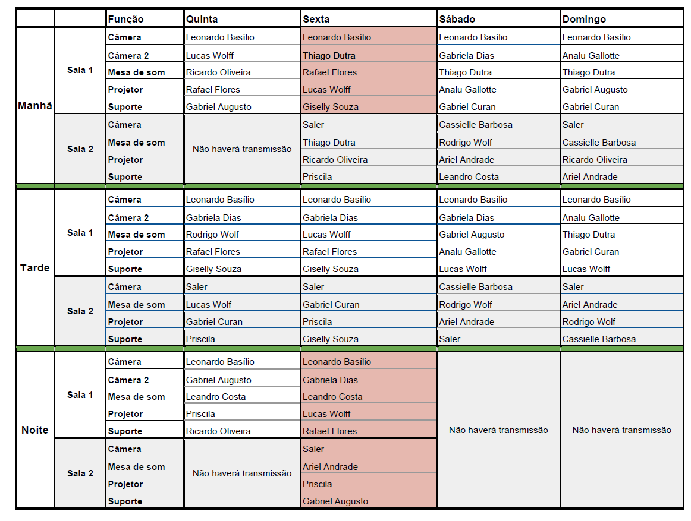

**IIPC**

**MANUAL DE PROCEDIMENTOS PARA REALIZAÇÃO DE GRANDES EVENTOS DO IIPC**

# Manual

## 1 - GRANDES EVENTOS

\- Qualificação Docente

\- Encontro de Voluntários

\- Semana Docente

\- Congressos

\- Curso Projeciologia & Reurbex

\- Celebrações instItucionais

## 2 -- NÚCLEOS E EQUIPES

\- Transmissão e Tecnologia da Informação

## 3 -- OBJETIVO

Organizar os diversos processos e fluxos de trabalho dos diferentes Núcleos existentes para a otimização de cada um dos eventos nas modalidades hibrida, [presencial]{.mark} ou à distância (online, síncrono).

**\
**

## NÚCLEOS

## I -- TRANSMISSÃO E TECNOLOGIA DA INFORMAÇÃO

### Objetivo

Orientar os procedimentos para realização da transmissão dos Grandes Eventos organizados pelo IIPC.

### Modalidade da transmissão

A depender do evento que está sendo organizado ele pode ser hibrido (evento com interação online) ou online.

### Equipe

É importante ser previamente definida a equipe que será responsável pela realização do Grande Evento. Caso seja na modalidade híbrido, as equipes deverão ser formadas para acompanhamento de todo o processo, sendo definido o número de voluntários e equipes de acordo com a proporção do evento.

O IIPC deve definir um coordenador de transmissão nacional. Para cada evento terá um epicentro que coordenará a transmissão do mesmo. Assim, o epicentro coordenará as equipes, e dependendo da modalidade contará com um epicentro que coordenará a equipe do presencial e outro epicentro que coordenará a equipe do online.

### Tipos de Eventos

Os Grandes Eventos realizados pelo IIPC podem ser por meio de lives, webinars, Cursos, talkshow e reuniões, como pré-evento e evento principal.

### Plataforma e software utilizado

A plataforma e software a ser utilizada vai depender do tipo de evento e da modalidade escolhida.

As plataformas e software disponíveis mais comumente utilizadas e a serem selecionadas para realização dos Grandes Eventos do IIPC são: Zoom, Teams e StreamYard.

#### StreamYard

É um software que funciona como um estúdio virtual, onde você pode fazer lives e transmiti-las através de redes sociais, até de forma simultânea, em mais de uma plataforma ao mesmo tempo. O StreamYard é um software de streaming em nuvem, usado na criação de conteúdos digitais ao vivo a partir de um navegador. Com ele, é possível produzir lives, webinars, apresentações e reuniões. Além disso, a ferramenta suporta a integração com até oito plataformas de streaming e redes sociais para compartilhar conteúdo de forma simultânea e em tempo real.

#### Zoom

O Zoom é uma plataforma baseada em nuvem que possibilita realizar videoconferências, cursos de treinamento online e outros tipos de eventos **online.**

#### Teams

### Equipamentos

Os equipamentos necessários para a transmissão vai variar segundo a modalidade: hibrido ou online.

Os equipamentos para uma transmissão presencial são:

-   Equipamentos para captar imagem e som.

-   Um computador com conexão a internet e uma placa de captura.

-   Microfone profissional.

-   Microfone de lapela.

-   Switcher (mesa de corte) + controlador.

-   Mesa de som digital (sonorização).

-   iluminação profissional.

-   Televisão.

-   Celular.

-   Suporte para celular.

-   Suporte para câmera.

## **Manual de procedimentos da transmissão **

[Eventos somente online]{.mark} 

Eventos híbridos 

-   Equipamentos 

<!-- -->

-   Incluir fotos e etiquetar os equipamentos numerados 

<!-- -->

-   O que é utilizado no presencial e como? 

<!-- -->

-   \[GABRIEL\] Celular para filmagens do salão (iphone 8) 

<!-- -->

-   \[ADQUIRIDO\] Tripé para o celular de filmagens do salão 

<!-- -->

-   \[WELTON\] Celular para filmagens das perguntas (Samsung s9) 

<!-- -->

-   \[A ADQUIRIR\] Suporte de mão para o celular volante 

<!-- -->

-   \[WELTON\] Power bank para o celular de perguntas 

<!-- -->

-   \[ADQUIRIDO\] Computador desktop com 3 monitores (2 + 1 espelhado) 

<!-- -->

-   \[ADQUIRIDO\] Teclado e mouse para o desktop 

<!-- -->

-   \[ADQUIRIDO\] Projetor 

<!-- -->

-   \[A ADQUIRIR\] Passador de slides 

<!-- -->

-   \[ADQUIRIDO\] Espalhador HDMI (1 entrada = 4 saídas) 

<!-- -->

-   \[ADQUIRIDO\] Monitor espelho do projetor (conectado ao computador) 

<!-- -->

-   \[ADQUIRIDO\] Microfones sem fio (4) 

<!-- -->

-   \[ADQUIRIDO\] Mesa de som amplificada com bluetooth 

<!-- -->

-   \[ADQUIRIDO\] Receptor Bluetooth 

<!-- -->

-   \[DO GABRIEL\] Tripé da câmera principal 

<!-- -->

-   \[ADQUIRIDO\] Câmera principal 

<!-- -->

-   \[ADQUIRIDO\] Lente com bastante zoom 

<!-- -->

-   \[ADQUIRIDO\] Cabo RCA x P2 e Cabo P2 e P10 duplo (pelo menos 5m)  

<!-- -->

-   \[ADQUIRIDO\] Extensão elétrica de diversos tamanhos 

<!-- -->

-   \[A ADQUIRIR\] Tablado para câmera e operador

<!-- -->

-   \[A ADQUIRIR\] Adaptadores DVI---HDMI 

<!-- -->

-   \[A ADQUIRIR\] Adaptador HDMI e VGA 

<!-- -->

-   \[A ADQUIRIR\] Monitores de palco (TV 42 polegadas) 

<!-- -->

-   \[ADQUIRIDO\] Cabo USB da câmera principal (com extensor USB) 

<!-- -->

-   \[ADQUIRIDO\] Nobreak 

<!-- -->

-   \[INCERTO\] Tripé para caixa de som? 

<!-- -->

-   \[INCERTO\] Caixa de som (Ribeirão Preto com amplificador) 

### **Qual a melhor configuração de posicionamento dos equipamentos? **

-   Microfone de perguntas

> Os microfones de perguntas podem ser opcionalmente fixo ou volante, a depender do número de voluntários da equipe e da expertise dos mesmos.
>
> No entanto, considerando que não temos câmera de alta qualidade e com controle remoto, o microfone fixo para perguntas ainda é a nossa melhor opção para os grandes eventos.

-   Monitor de palco

No mínimo devemos ter um monitor de palco. Caso o número de palestrantes seja maior que cinco ou o espaço de palco seja extenso, podem ser utilizados dois ou mais monitores de palco.

É importante ter na mesa de transmissão um monitor espelhado para o monitor de palco. 

-   Layout de conexão dos conectores. 

Antecedendo ao evento deve ser definido o esquema de conexões da transmissão, com o esboço para que a equipe de transmissão possa acompanhar o processo de instalação.

-   Tripé da câmera principal

O posicionamento do tripé da câmera principal vai depender do tipo de evento e do layout da sala, sendo preferencialmente numa altura mais elevada. 

-   **Papéis da equipe de transmissão**

<!-- -->

-   Epicentro do evento 

-   Epicentro do presencial 

<!-- -->

-   Epicentro do online 

<!-- -->

-   **Processos e fluxos de trabalho **

<!-- -->

-   Construção das planilhas 

Equipe -- construir uma planilha definindo as equipes, função e horários de trabalho.

-   Uso das pastas de apresentações e divulgações

> A equipe de transmissão deve receber com antecedência as planilhas com os materiais a serem divulgados durante o evento, assim como o roteiro para orientação dos trabalhos.

-   Etiquetagem dos equipamentos 

Cada microfone é etiquetado com uma cor de referência, que é a mesma da mesa de controle.

Computador com telas conectadas para: retroprojetor para apresentações gerais; retroprojeto apresentando as pessoas do online para o presencial; monitor para comunicação com equipe online e gerenciamento dos materiais.  

[PARAMOS AQUI]{.mark}

-   Melhores práticas 

<!-- -->

-   A proximidade do monitor com o professor é fundamental para criar o rapport com o aluno online. (necessário ver o branco do olho). 

<!-- -->

-   Incluir diagramas de exemplo (ou captura de vídeo de algum evento). 

<!-- -->

-   Enquadramento utilizado na câmera principal deve ser bem apertado, bem próximo de quem está falando, para permitir uma boa experiência e conexão de quem está online. 

<!-- -->

-   Incluir diagramas de exemplo (ou captura de vídeo de algum evento). 

<!-- -->

-   Projetor: dependendo do evento tem que ser alugado 

## [Como fazer uma transmissão ao vivo (presencial)]{.mark}

[Estabeleça um objetivo.]{.mark}

[Planeje o conteúdo.]{.mark}

[Escolha os equipamentos.]{.mark}

[Monte o cenário.]{.mark}

[Cuide da iluminação.]{.mark}

[Use equipamentos de captação de áudio.]{.mark}

[Tenha uma boa conexão de internet.]{.mark}

[Faça testes antes de iniciar a transmissão.]{.mark}

[Quadro com quantidade, especificação, próprio ou para aluguel]{.mark}

[Como proceder em caso de contratação de empresa para aluguel de equipamento.]{.mark}

[Transmissão presencial em espaço próprio do IIPC e em local alugado (como hotel).]{.mark}

[Desafios e soluções]{.mark}

[Dicas de otimizações]{.mark}

[Prazo para cada etapa]{.mark}

[Responsabilidades -- equipes]{.mark}

[Iniciativas de segurança: redundância;]{.mark}

[Situações exemplificadoras a partir das experiências vivenciadas]{.mark}

**\
**

## Cronograma para elaboração do Manual de Procedimentos

# ANOTAÇÕES DE ANA CERES

===========================================================

**7 ago 2024**

Seguem algumas orientações e preparativos para o curso:

1\. Procure um ambiente reservado na sua residência para acompanhar todo o curso sem interrupções externas, a fim de manter a concentração e a conexão com a equipe extrafísica de amparadores.

2\. Se organize com papel e caneta à mão para as suas anotações pessoais.

3\. Por questão de parassegurança, não é indicado participar do evento em trânsito (dirigindo ou como passageiro) e em locais públicos (ônibus, hospital, praça pública, lanchonete, etc).

4\. Mantenha a câmera aberta e o microfone fechado durante a explanação. A qualquer momento você poderá abrir o microfone e trazer suas dúvidas e contribuições, para isso clique na mãozinha ou levante mão para que os professores possam lhe chamar.

5\. Providencie um local com bom acesso à internet.

6\. A sala será aberta às 8h45 e o curso iniciará pontualmente às 9h. Procure entrar com antecedência para testar o microfone e para evitar problemas técnicos.

7\. O curso será realizado na plataforma Zoom. Certifique-se de tê-lo instalado em seu computador ou celular previamente.

O link de acesso ao zoom será enviado aqui no grupo.

Orientação para o aluno online

=================================================================

**8 ago 2024**

**Monitoria Transmissão I Congresso de Conscienciologia**

{width="5.905555555555556in" height="4.456897419072616in"}

**Checklist - Função projetor**

-   **Slides** - conferir se todos estão numerados de acordo com a sequência de apresentação do turno;

-   **Powerpoint** - Conferir se todas as apresentações estão em formato powerpoint;

-   **Apresentação** - Conferir o modo de apresentação testando;

-   **Zoom-** Compartilhamento com Zoom -- testar;

-   **Som** - Conferir se há vídeos ou áudios no slade e passar a informação para a mesa de som;

-   **Vídeo** - Observar no documento do cerimonial se há algum vídeo preparar a apresentação e passar a informação para a mesa de som;

-   **Sorteio** - Observar no documento do cerimonial se há sorteio.

-   **Transmissão com Palestrantes online**-

<!-- -->

-   Compartilhar o slide do professor;

-   Passar o controle do slide para o professor online;

-   Deixar 2 projetores com a imagem do slade e outro com o a imagem do professor; (para isso é necessário mais um computador conectado ao zoom)

**Checklist - Função Mesa de som**

-   **Pilhas** -- Ao iniciar o turno, conferir se todas as pilhas dos microfones estão carregadas; retirar pilhas descarregadas ou com carga baixa dos microfones e por pra carregar;

-   **Mesa de som** - Controlar som dos microfones presenciais e do som vindo do computador.

-   **Programação** - Conferir com a monitoria dos slides se há vídeos a serem

-   **Som Ambiente** - Deixar no começo e nos intervalos do evento som de fundo com da playlist pré-selecionada. (Em parceria com monitoria dos slides)

-   **Slides** - Conferir se os slides estão numerados de acordo com a sequência de apresentação do turno;

**Checklist -- Suporte**

-   **Atenção** - Ficar atendo às demandas da transmissão;

-   **Apoio** - Ficar na função dos colegas escalados em caso de necessidade;

**Checklist -- Câmera**

-   **Foco** - Filmar todo o evento revezando câmeras de palco e perguntas;

-   **Gravar** - Fazer a gravação de todos os períodos do evento na máquina;

==============================================

12 ago 2024

São as informações sem as quais o IIPCNET não aceita agendar o evento. É importante também que o release e a arte tenham passado pela avaliação do Técnico Científico antes, para evitar que o link saia com erros.

<https://1drv.ms/w/c/ca868f0c70d8b973/Eab1KCyztY1CuSGbkljkKY0BTRhEwPmO1bCWeKGHpdZ86g?e=7VO2eL>

Checklist para a criação e agendamento de eventos:

Título do Curso ou Evento;

Tipo: Presencial ou online;

Tema;

Início data e hora;

Fechamento do evento (data e horário);

Término (data e horário, geralmente o mesmo do fechamento);

Dias da semana;

Datas das aulas;

Horário (dia da semana com horário de início e término pela manhã, horário de intervalo e início e término à tarde ou noite);

Localidade: (IIPC SEDE ou outro);

Local (cidade);

Endereço;

Plataforma de Publicação: Woocommerce para pagos e Sympla para gratuitos;

No de vagas;

No de alunos previstos;

Ticket médio previsto;

Executivo;

Professor P1;

Professor P2;

Monitor;

Para a solicitação do link é necessário anexar:

Release aprovado pelo Técnico Científico;

Arte aprovada pelo Técnico Científico.

**Referências**

(1) https://rockcontent.com/br/blog/streamyard/
